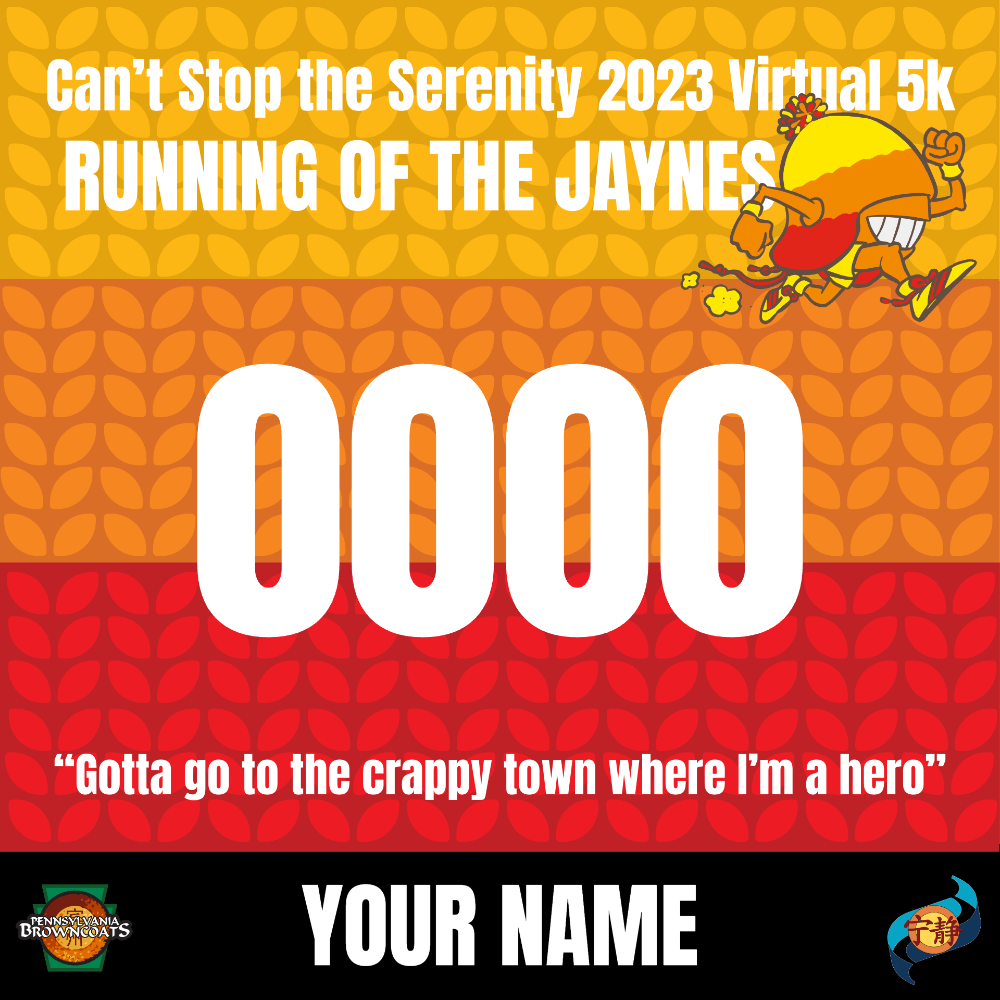

# Running of the Jaynes
A custom race bib application for a charity 5k.

[https://nelilly.github.io/running-of-the-jaynes/](https://nelilly.github.io/running-of-the-jaynes/)

On the page, choose your bib and right click on the bib to save it. Or print directly from the browser window on a letter-size sheet of paper.

<figure>

<figcaption>Race Bib</figcaption>
</figure>

Visit the [Pennsylvania Browncoats: Running of the Jaynes page](http://pabrowncoats.com/csts/running-of-the-jaynes/) for more information.
